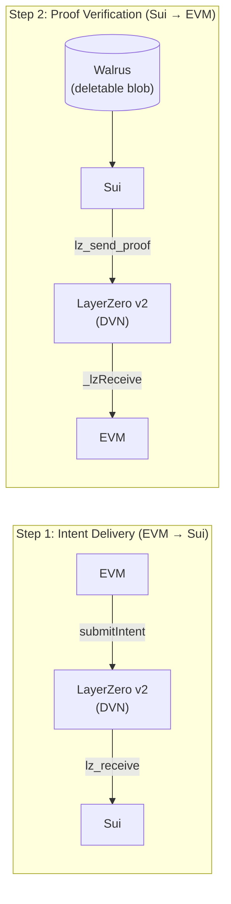

# Bosphor

[](https://github.com/riva-labs/bosphor/actions/workflows/ci.yml)
[](LICENSE)
[](https://nodejs.org/)

> Cross-chain storage intent routing for [Walrus](https://walrus.xyz).

Bosphor routes storage intents from any EVM chain to Walrus on Sui via
LayerZero v2, returning verifiable proof of execution to the origin chain.

## How It Works (Two-Step Verification)



1. **Step 1 (Intent Delivery):** User calls `submitIntent(payload, deadline)` on EVM. LayerZero DVN verifies and delivers the message to Sui.
2. **Step 2 (Proof Verification):** Relayer uploads the payload to Walrus, calls `execute_store` on Sui, then sends DVN-verified proof back to EVM via LayerZero (`lz_send_proof`).

## Status

| Component | Status |
|-----------|--------|
| EVM Adapter (Sepolia) | Deployed |
| Sui LZ OApp (Testnet) | Deployed |
| Relayer | Running (NestJS) |
| LZ Executor | Verified (DELIVERED) |
| Mainnet | Planned |

## Prerequisites

- [Node.js 22](https://nodejs.org/) (pinned via `.nvmrc`)
- [Foundry](https://book.getfoundry.sh/getting-started/installation) for Solidity compilation and testing
- [Sui CLI](https://docs.sui.io/guides/developer/getting-started/sui-install) for Move compilation and deployment
- [Docker](https://docs.docker.com/get-docker/) (optional, for containerized relayer)

## Quickstart

```bash
git clone --recurse-submodules https://github.com/riva-labs/bosphor
cd bosphor && nvm use && npm install
cp .env.example .env  # fill in keys
npm run new-deployment
```

See [website/docs/deployment.md](website/docs/deployment.md) for detailed setup instructions.

## Architecture

- `contracts/evm/src/BosphorAdapter.sol` — EVM OApp (LayerZero v2)
- `sui/lz-receiver/sources/lz_receiver.move` — Sui LZ receiver
- `sui/executor/sources/walrus_executor.move` — Walrus blob executor
- `relayer/` — NestJS relayer service with health endpoint

See [website/docs/architecture.md](website/docs/architecture.md) for the full design.

## Documentation

- [Architecture](https://docs.bosphor.xyz/architecture) — system design and message flow
- [Contract Interface](https://docs.bosphor.xyz/contract-interface) — EVM and Sui function reference
- [Deployment](https://docs.bosphor.xyz/deployment) — setup and deployment guide
- [Relayer](https://docs.bosphor.xyz/relayer) — operator guide, configuration, health endpoint
- [Testing](https://docs.bosphor.xyz/testing) — test suites, CI pipeline, E2E verification

## Testnet Evidence

| Step | TX |
|------|----|
| EVM Intent | [0xde576c...](https://sepolia.etherscan.io/tx/0xde576c41b95c5f19dfb86600b6d08705c2fbdc1205969beaf909852184765aa2) |
| LZ DELIVERED | [LZ Explorer](https://testnet.layerzeroscan.com/tx/0xde576c41b95c5f19dfb86600b6d08705c2fbdc1205969beaf909852184765aa2) |
| Sui Execution | [5dcGjoC9...](https://suiscan.xyz/testnet/tx/5dcGjoC9qz4EaN9KSkTvJAmsper1xkMoCRfdn1zBrZMv) |
| Walrus Blob | [1sfeIRiJ...](https://walruscan.com/testnet/blob/1sfeIRiJCxR_2HtapNCfGUkoMbsl5Mqj5sIwR8PLQvU) |
| EVM Confirm | [0x941966...](https://sepolia.etherscan.io/tx/0x9419666133c7b876c1ccebecc73d83af9356a6972fed1c6728d1b7cc079c1309) |

## Deployed Contracts

| Contract | Network | Address |
|----------|---------|---------|
| BosphorAdapter | Sepolia | `0x3c8B7A1c684dD10aEd6Bb392651c678f1CE05E10` |
| Sui Package | Sui Testnet | `0x169f0ece587a5b54cf39218cdf5319ba7ecbb7d403b022802f1f329dbee3e596` |
| Sui OApp | Sui Testnet | `0x4a5bf89e083c16bd8034b027454057d30ec336c734a7cc274e857a9125540026` |

## Docker

```bash
docker-compose up -d    # starts relayer + prometheus + grafana
```

## Contributing

See [CONTRIBUTING.md](.github/CONTRIBUTING.md).

## License

[MIT](LICENSE)
