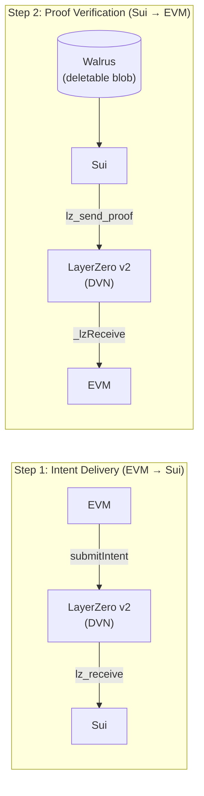

# Bosphor

[](https://github.com/riva-labs/bosphor/actions/workflows/ci.yml)
[](LICENSE)
[](https://nodejs.org/)

> Cross-chain storage intent routing for [Walrus](https://walrus.xyz).

Bosphor routes storage intents from any EVM chain to Walrus on Sui via
LayerZero v2, returning verifiable proof of execution to the origin chain.

## How It Works (Two-Step Verification)



1. **Step 1 (Intent Delivery):** User calls `submitIntent(payload, deadline)` on EVM. LayerZero DVN verifies and delivers the message to Sui.
2. **Step 2 (Proof Verification):** Relayer uploads the payload to Walrus, calls `execute_store` on Sui, then sends DVN-verified proof back to EVM via LayerZero (`lz_send_proof`).

## Status

| Component | Status |
|-----------|--------|
| EVM Adapter (Sepolia) | Deployed |
| Sui LZ OApp (Testnet) | Deployed |
| Relayer | Running (NestJS) |
| LZ Executor | Verified (DELIVERED) |
| Mainnet | Planned |

## Prerequisites

- [Node.js 22](https://nodejs.org/) (pinned via `.nvmrc`)
- [Foundry](https://book.getfoundry.sh/getting-started/installation) for Solidity compilation and testing
- [Sui CLI](https://docs.sui.io/guides/developer/getting-started/sui-install) for Move compilation and deployment
- [Docker](https://docs.docker.com/get-docker/) (optional, for containerized relayer)

## Quickstart

```bash
git clone --recurse-submodules https://github.com/riva-labs/bosphor
cd bosphor && nvm use && npm install
cp .env.example .env  # fill in keys
npm run new-deployment
```

See [website/docs/deployment.md](website/docs/deployment.md) for detailed setup instructions.

## Architecture

- `contracts/evm/src/BosphorAdapter.sol` — EVM OApp (LayerZero v2)
- `sui/lz-receiver/sources/lz_receiver.move` — Sui LZ receiver
- `sui/executor/sources/walrus_executor.move` — Walrus blob executor
- `relayer/` — NestJS relayer service with health endpoint

See [website/docs/architecture.md](website/docs/architecture.md) for the full design.

## Documentation

- [Architecture](https://docs.bosphor.xyz/architecture) — system design and message flow
- [Contract Interface](https://docs.bosphor.xyz/contract-interface) — EVM and Sui function reference
- [Deployment](https://docs.bosphor.xyz/deployment) — setup and deployment guide
- [Relayer](https://docs.bosphor.xyz/relayer) — operator guide, configuration, health endpoint
- [Testing](https://docs.bosphor.xyz/testing) — test suites, CI pipeline, E2E verification

## Testnet Evidence

| Step | TX |
|------|----|
| EVM Intent | [0x223d...](https://sepolia.etherscan.io/tx/0x223d075c73facfa48bddce0e4316548924b40a0fd362ad3628b0a59ae5c1c40c) |
| LZ DELIVERED | [LZ Explorer](https://testnet.layerzeroscan.com/tx/0x223d075c73facfa48bddce0e4316548924b40a0fd362ad3628b0a59ae5c1c40c) |
| Sui Execution | [3MmJ1nk...](https://suiscan.xyz/testnet/tx/3MmJ1nkJEzzmBV9uFFBKdgqJM9sZi3xajJQrZw91WVNW) |
| Walrus Blob | [rfj52maH...](https://walruscan.com/testnet/blob/rfj52maH_ZyCqaMVIfMOJLUtNnu8ZQ_y-8ZW3pUa63s) |
| EVM Confirm | [0x13243e...](https://sepolia.etherscan.io/tx/0x13243e35227e6f2a421381bd1b48191e8fee67a0169861b688861337d7a774f6) |

## Deployed Contracts

| Contract | Network | Address |
|----------|---------|---------|
| BosphorAdapter | Sepolia | `0xbC7EF2F021F517d871282C2bb512C741ad2958c3` |
| LZ OApp | Sui Testnet | `0xa4420716d875fa323c5d543876d03979607dea3c428818566d25d82fea6f6656` |

## Docker

```bash
docker-compose up -d    # starts relayer + prometheus + grafana
```

## Contributing

See [CONTRIBUTING.md](.github/CONTRIBUTING.md).

## License

[MIT](LICENSE)
