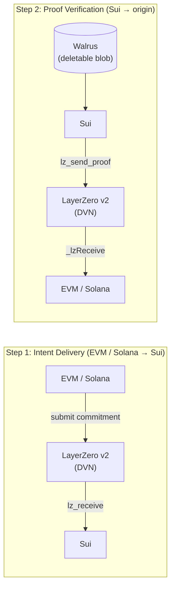

# Bosphor

[](https://github.com/riva-labs/bosphor/actions/workflows/ci.yml)
[](LICENSE)
[](https://nodejs.org/)

> Cross-chain storage intent routing for [Walrus](https://walrus.xyz).

Bosphor routes storage intents from any EVM chain or Solana to Walrus on Sui via
LayerZero v2, returning verifiable proof of execution to the origin chain. The
cross-chain message carries only a compact commitment (the Walrus blob id, size,
encoding, and storage duration); the file itself travels out-of-band over HTTP,
so the cross-chain fee is flat regardless of file size.

The developer-facing entry point is the TypeScript SDK, `@bosphor/sdk`, with one
`store()` call for both EVM and Solana. Its guides and API reference live at
**[sdk.bosphor.xyz](https://sdk.bosphor.xyz)**.

## How It Works (Two-Step Verification)


```mermaid
flowchart LR
    subgraph step1 ["Step 1: Intent Delivery (EVM / Solana → Sui)"]
        EVM1["EVM / Solana"] -- "submit commitment" --> LZ1["LayerZero v2\n(DVN)"] -- "lz_receive" --> Sui1["Sui"]
    end
    subgraph step2 ["Step 2: Proof Verification (Sui → origin)"]
        Sui2["Sui"] -- "lz_send_proof" --> LZ2["LayerZero v2\n(DVN)"] -- "_lzReceive" --> EVM2["EVM / Solana"]
        Walrus[("Walrus\n(deletable blob)")] --> Sui2
    end
```

1. **Step 1 (Intent Delivery):** The SDK computes the Walrus blob id locally, and the origin contract submits a compact **commitment** (blob id, size, encoding, storage duration, deadline). LayerZero DVN verifies and delivers it to Sui. The file bytes reach the relayer **out-of-band** over HTTP, never through the bridge.
2. **Step 2 (Proof Verification):** The relayer stores the bytes on Walrus; `execute_store` on Sui asserts the stored blob id and end epoch match the commitment; then a DVN-verified proof returns to the origin chain (`lz_send_proof`), which verifies the returned blob id equals the committed one.

## Status

| Component | Status |
|-----------|--------|
| EVM Adapter (Sepolia) | Deployed (reference-commitment) |
| Solana Adapter (Devnet) | Deployed (round-trip live) |
| Sui LZ OApp (Testnet) | Deployed |
| TypeScript SDK (`@bosphor/sdk`) | Published (EVM + Solana, `store()`) |
| SDK docs (sdk.bosphor.xyz) | Live (Fumadocs) |
| Relayer | Running (NestJS) |
| LZ Executor | Verified (DELIVERED) |
| Monitoring stack | Live (Prometheus + Grafana) |
| Canary | Running (continuous round-trips) |
| Public API | Live (`GET /public/intents` at api.bosphor.xyz) |
| Status page | Live (Kener at status.bosphor.xyz) |
| Mainnet | Validated (round-trip on mainnet) |

## Prerequisites

- [Node.js 22](https://nodejs.org/) (pinned via `.nvmrc`)
- [Foundry](https://book.getfoundry.sh/getting-started/installation) for Solidity compilation and testing
- [Sui CLI](https://docs.sui.io/guides/developer/getting-started/sui-install) for Move compilation and deployment
- [Docker](https://docs.docker.com/get-docker/) (optional, for containerized relayer)

## Quickstart

```bash
git clone --recurse-submodules https://github.com/riva-labs/bosphor
cd bosphor && nvm use && npm install
```

This is not an npm workspace yet: `npm install` at the root only installs the
root tooling. Each package (`relayer/`, `sdk/`, `canary/`, `website/`,
`sdk-docs/`) has its own `package.json`, so install the ones you work on, e.g.
`(cd relayer && npm install)`.

Run the test gate (no keys or services needed for `forge`/`move`/relayer unit
tests):

```bash
npm test            # forge + move + relayer + sdk
```

`npm run new-deployment` (deploy + wire + e2e) is a maintainer flow: it submits
real testnet transactions and needs a funded wallet and a running relayer, so
fill `.env` first (`cp .env.example .env`) and start the relayer. See
[website/docs/deployment.md](website/docs/deployment.md) for the full setup.

## Using the SDK

To integrate Bosphor into an app, use `@bosphor/sdk` rather than the raw
contracts. One `store()` call runs the whole cross-chain flow and returns a
result verified against on-chain state.

```bash
npm install @bosphor/sdk ethers @mysten/walrus @mysten/sui
```

```ts
import { createBosphorClient } from "@bosphor/sdk/evm";

const client = createBosphorClient({
  adapter,                  // an ethers.Contract bound to BosphorAdapter (with a signer)
  relayerUrl: "https://api.bosphor.xyz/testnet",
  dstEid: 40378,            // Sui testnet
});

const { intentId, blobId, endEpoch } = await client.store(bytes, { epochs: 5 });
```

Full guides, the Solana path, and the API reference are at
**[sdk.bosphor.xyz](https://sdk.bosphor.xyz)**.

## Architecture

- `contracts/evm/src/BosphorAdapter.sol`: EVM OApp (LayerZero v2)
- `contracts/sui/lz-receiver/sources/lz_receiver.move`: Sui LZ receiver
- `contracts/sui/executor/sources/walrus_executor.move`: Walrus blob executor
- `relayer/`: NestJS relayer service with health endpoint

See [website/docs/architecture.md](website/docs/architecture.md) for the full design.

## Documentation

- [SDK docs (sdk.bosphor.xyz)](https://sdk.bosphor.xyz): the TypeScript SDK, guides for EVM and Solana, and the generated API reference
- [Architecture](https://docs.bosphor.xyz/architecture): system design and message flow
- [Contract Interface](https://docs.bosphor.xyz/contract-interface): EVM and Sui function reference
- [Deployment](https://docs.bosphor.xyz/deployment): setup and deployment guide
- [Relayer](https://docs.bosphor.xyz/relayer): operator guide, configuration, health endpoint
- [Testing](https://docs.bosphor.xyz/testing): test suites, CI pipeline, E2E verification
- [Public API](https://docs.bosphor.xyz/public-api): read-only intent feed (`GET /public/intents`)
- [Canary](https://docs.bosphor.xyz/canary): continuous synthetic round-trip monitoring
- [Chaos Harness](https://docs.bosphor.xyz/chaos-harness): on-demand resilience testing

## Testnet Evidence

| Step | TX |
|------|----|
| EVM Intent | [0xde576c...](https://sepolia.etherscan.io/tx/0xde576c41b95c5f19dfb86600b6d08705c2fbdc1205969beaf909852184765aa2) |
| LZ DELIVERED | [LZ Explorer](https://testnet.layerzeroscan.com/tx/0xde576c41b95c5f19dfb86600b6d08705c2fbdc1205969beaf909852184765aa2) |
| Sui Execution | [5dcGjoC9...](https://suiscan.xyz/testnet/tx/5dcGjoC9qz4EaN9KSkTvJAmsper1xkMoCRfdn1zBrZMv) |
| Walrus Blob | [1sfeIRiJ...](https://walruscan.com/testnet/blob/1sfeIRiJCxR_2HtapNCfGUkoMbsl5Mqj5sIwR8PLQvU) |
| EVM Confirm | [0x941966...](https://sepolia.etherscan.io/tx/0x9419666133c7b876c1ccebecc73d83af9356a6972fed1c6728d1b7cc079c1309) |

## Deployed Contracts

| Contract | Network | Address |
|----------|---------|---------|
| BosphorAdapter | Sepolia | `0x3c8B7A1c684dD10aEd6Bb392651c678f1CE05E10` |
| Sui Package | Sui Testnet | `0x169f0ece587a5b54cf39218cdf5319ba7ecbb7d403b022802f1f329dbee3e596` |
| Sui OApp | Sui Testnet | `0x4a5bf89e083c16bd8034b027454057d30ec336c734a7cc274e857a9125540026` |

## Docker

```bash
docker-compose up -d    # starts relayer + canary + prometheus + grafana
```

## Contributing

See [CONTRIBUTING.md](.github/CONTRIBUTING.md).

## License

[MIT](LICENSE)
