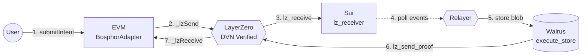

# Bosphor Architecture

## System Overview



### Message Flow

1. **EVM -> Sui** (LayerZero): `submitIntent` sends `intentId(32) ++ commitment(49)` = 81 bytes (`abi.encodePacked`) through LayerZero v2 OApp messaging. The commitment holds the Walrus blob id, size, encoding, storage duration, and deadline; no raw blob bytes are on the wire. See [Commitment Format](commitment-format.md).
2. **Sui lz_receive**: LZ executor builds a PTB using `ptb_builder::build_lz_receive_ptb`, calls `lz_receiver::lz_receive` which validates peer + endpoint and emits `IntentReceived`.
3. **Relayer**: Polls `IntentReceived` events on Sui, receives the file bytes out-of-band over HTTP (`POST /blob/{intentId}`), uploads them to Walrus, and calls `execute_store`. The bytes never cross the bridge.
4. **Sui -> EVM** (LayerZero): Relayer calls `lz_send_proof` on Sui, which sends a type 1 message via LayerZero back to EVM. The EVM `_lzReceive` decodes `(intentId, blobId, endEpoch)` and marks the intent as executed.

## EVM Adapter Contract (BosphorAdapter.sol)

The EVM adapter handles intent submission, fee quoting, and proof receipt. Key functions: `submitIntent`, `quote`, `_lzReceive` (proof path), and `confirmExecution` (trusted-relayer fallback). Intent IDs are derived as `keccak256(commitment(49) ++ sender(32) ++ nonce(u64))`; see [Commitment Format](commitment-format.md). On proof receipt the adapter asserts the returned blob id equals the committed one (`BlobIdMismatch` otherwise).

For the complete interface reference, function signatures, events, errors, and code examples, see [Contract Interface](contract-interface.md).

## Sui Walrus Executor

### lz_receiver.move

Receives cross-chain messages from EVM via LayerZero v2 executor.

- `lz_receive(config, oapp, call, ctx)`: Validates the LZ Call hot-potato, splits the 81-byte message into `intentId(32)` and `commitment(49)`, decodes the commitment (blob id, size, encoding, storage epochs, deadline), records the committed blob id and storage epochs in the `received_intents` table, and emits `IntentReceived`.
- `register_oapp(config, oapp, endpoint, info, ctx)`: Entry function that registers the OApp with the LZ endpoint using the internal CallCap.
- `committed_blob_id(config, intent_id)` / `committed_storage_epochs(config, intent_id)`: View functions returning the committed reference, read by `execute_store`.
- `is_received(config, intent_id)`: View function to check if an intent was received.

### commitment_codec.move

Encodes and decodes the 49-byte reference commitment (`blobId(32) ++ size(u32) ++ encodingType(u8) ++ storageEpochs(u32) ++ deadline(u64)`, big-endian). It is the Move half of the single cross-chain `CommitmentCodec`, pinned byte-for-byte against shared parity vectors alongside the Solidity, TypeScript, and Rust implementations. See [Commitment Format](commitment-format.md).

### codec.move

Encodes and decodes type-1 proof messages exchanged between Sui and EVM via LayerZero.

- `encode(intent_id, blob_id, end_epoch)`: Builds a 97-byte proof message: `[0x01][intentId(32)][blobId(32)][endEpoch(32, big-endian u256)]`. Used by `lz_send_proof` and `quote_proof`.
- `decode(message)`: Extracts `(intent_id, blob_id, end_epoch)` from a 97-byte type-1 message. Validates the type prefix and length.

Wire format: `bytes1(0x01) ++ intentId(32) ++ blobId(32) ++ endEpoch(32)`

### walrus_executor.move

Executes storage operations on Walrus.

- `execute_store(config, lz_config, system, intent_id, blob, deadline_ms, clock, original_sender, ctx)`: Accepts a certified Walrus `Blob`, verifies certification and deadline, asserts the certified blob matches the committed reference recorded by `lz_receive` (blob id and storage epochs, read from `LzReceiverConfig`), records execution, emits `StorageExecuted`, and transfers blob and receipt to the original sender.
- All blobs are stored as **deletable** per project policy.

### ptb_builder.move

Generates PTB metadata for the LZ executor.

- `lz_receive_info(config, oapp)`: Returns `OAppInfoV1`-encoded bytes containing the PTB construction instructions. The executor uses this to dynamically build `lz_receive` transactions.
- `build_lz_receive_ptb(config, oapp, call)`: Called by the executor during simulation to produce the actual `MoveCall` vector for `lz_receive`.

**Critical**: `lz_receive_info` must return `OAppInfoV1`-formatted bytes (not raw MoveCall bytes). The LZ executor deserializes the response as `OAppInfoV1 { oapp_object, next_nonce_info, lz_receive_info, extra_info }`.

## Two-Step Verification Pipeline

### Step 1: Intent Delivery (EVM -> Sui)

1. `submitIntent` calls `_lzSend` with the 81-byte `intentId(32) ++ commitment(49)` message
2. LayerZero DVN (LayerZero Labs) verifies the message on Sui endpoint
3. Confirmation depth: 2 blocks
4. LZ executor reads `OAppInfoV1` from endpoint registry, builds PTB, executes `lz_receive`

### Step 2: Proof Verification (Sui -> EVM)

DVN-verified proof delivery:
1. Relayer observes `IntentReceived` event on Sui
2. Uploads the out-of-band bytes to Walrus (deletable blob)
3. Calls `execute_store` on Sui
4. Calls `lz_send_proof` on Sui, which sends a type 1 message via LayerZero
5. EVM `_lzReceive` decodes `(intentId, blobId, endEpoch)` and marks intent as executed

Wire format: `bytes1(0x01) ++ abi.encode(intentId, blobId, endEpoch)`

Emergency fallback: owner can call `confirmExecution` directly on EVM.

### OAppInfoV1 Registration

The OApp must register with the LZ endpoint using `OAppInfoV1::encode()` format:

```
[version: u16 = 1][BCS(OAppInfoV1 {
    oapp_object: address,
    next_nonce_info: vector<u8>,
    lz_receive_info: vector<u8>,
    extra_info: vector<u8>,
})]
```

Where `lz_receive_info` itself contains:
```
[version: u16 = 1][BCS(vector<MoveCall>)]
```

## Known Limitations

| Limitation | Severity | Resolution Plan |
|-----------|----------|-----------------|
| Relayer is centralized (trusted operator) | Medium | Permissionless relayer auction (Milestone 4) |
| No origin-chain payment flow | Medium | Escrow-based payment (Milestone 4) |
| Sui testnet only | Low | Mainnet after Milestone 2 |
| Cross-chain path uses a self-operated LayerZero DVN | Low | Multi-DVN in further hardening |
| Relayer triggers proof verification | Low | Permissionless relayer auction (Milestone 4) |
